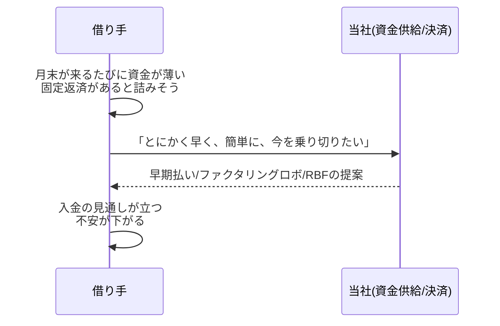
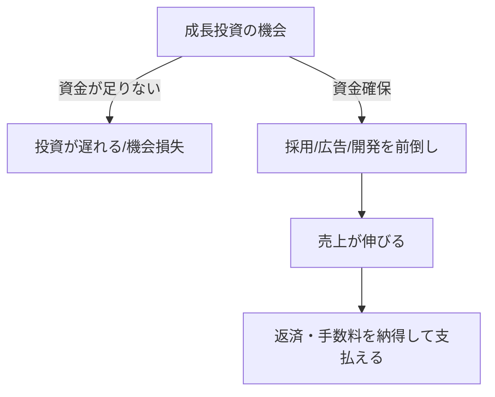
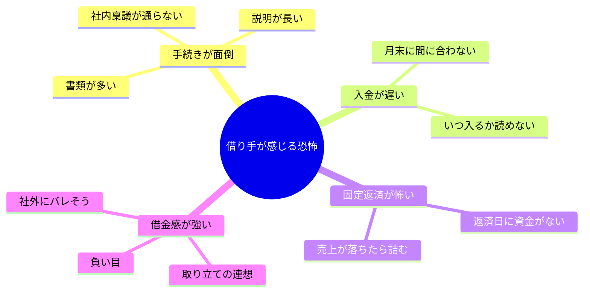
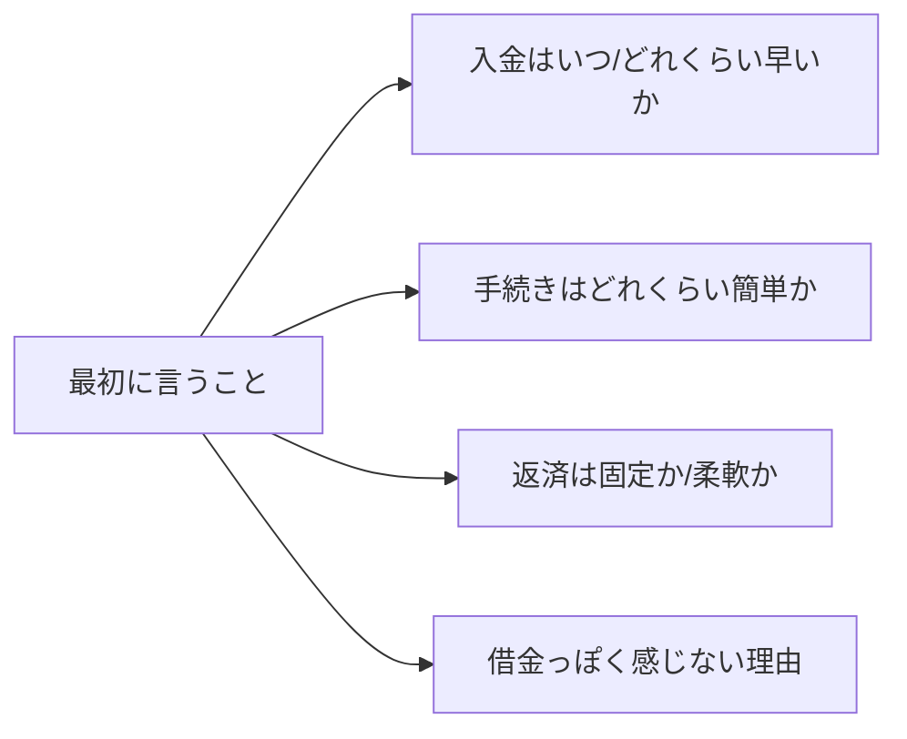

# 借り手の「感情」で比較する資金供給オプション（別章・感情比較編）

本章は、既存の **貸主視点の定量比較（キャッシュフロー・回収・利息）** とは独立に、**借り手の感情（心理的抵抗/安心感）**で比較するための資料です。  
対象プロダクトは以下の4つです（提供額1,000万円の前提は維持。ただし本章は“感情比較”が主目的）。

- RBF
- ファクタリングロボ for SaaS（将来債権の一括資金化＋請求代行）
- 早期払い（決済：月末締め翌1日払い、上乗せ0.5%）
- 前借り君（※将来オプション：**現時点では提供できない**）

---

## 0. この章の結論（要点）

- **借り手が最重視**: 「契約/手続きが簡単」「早い」「返済が柔軟」  
- **本章の第4軸**: **借金感（＝心理的抵抗）の少なさ** を最重視する
- **前借り君の扱い**: 貸付スキームのため **貸金業登録等の体制整備が前提**。本資料では **将来の検討オプション**として掲載する（今すぐ提供できないことを明記）

---

## 1. 借り手ペルソナ（今回の主対象）

### ペルソナA：資金繰りが苦しい（延命・安全確保）
- いま怖いもの：資金ショート、固定返済で詰むこと、稟議/手続きで遅れること
- 欲しいもの：**早い**・**簡単**・**柔軟**（心理的に「助かる」）

### ペルソナB：成長投資したい（前倒しで攻める）
- いま怖いもの：機会損失（遅れて負ける）、固定返済で成長が鈍る、手続き負担
- 欲しいもの：**一括で手元資金が増える実感**、返済の“納得感”、運用の簡単さ

---

## 2. 感情比較の評価軸（4軸）

### 軸1：簡単（契約・手続きの心理負担）
- 書類、説明の長さ、関係者（法務/経理/取引先）巻き込みの少なさ

### 軸2：早い（入金までの体感）
- 「いつ入るか」が見える/読める、待ちが少ない

### 軸3：返済が柔軟（固定返済の恐怖が減る）
- 売上連動、固定支払の少なさ、資金繰り悪化時の詰みやすさ

### 軸4：借金感が少ない（心理的抵抗の小ささ）※最重要
- 「借金をしている感じ」「取り立てられそう」「負い目が残る」などの抵抗が小さいほど高評価

---

## 3. 図表①：感情マトリクス（俯瞰・1枚で比較）

評価記号:
- ◎ = 強い安心/抵抗が小さい
- ○ = 概ね良い
- △ = 条件や説明次第で不安が出る
- × = 借り手心理として重い/抵抗が大きい

| 手段 | 簡単（手続き） | 早い（入金体感） | 返済が柔軟 | 借金感が少ない（最重要） | コメント（借り手の脳内） |
|---|---:|---:|---:|---:|---|
| **早期払い** | ◎ | ◎ | ○ | ◎ | 「毎月の入金が早いだけ。借金っぽくない」 |
| **ファクタリングロボ for SaaS** | ○ | ◎ | ○ | ○ | 「一括で入るのは強い。契約/請求の説明が長いと不安」 |
| **RBF** | ○ | ○ | ◎ | △ | 「返済が柔軟は良い。理解できないと“結局借金？”」 |
| **前借り君（将来）** | △ | ○ | ◎（設計次第） | ×〜△ | 「“貸付”の文脈が出ると借金感が強い」 |

> 注：この表は“借り手心理”の比較であり、実際の提供条件/審査/運用設計によって上下します。

---

## 4. 図表②：ペルソナA/B別「刺さる順」チャート（優先度）

```mermaid
flowchart LR
  A[ペルソナA<br/>資金繰りが苦しい] --> A1[早期払い<br/>毎月すぐ入る/借金感小]
  A --> A2[ファクタリングロボ for SaaS<br/>一括で酸欠を解消]
  A --> A3[RBF<br/>固定返済の恐怖を減らせる]
  A --> A4[前借り君(将来)<br/>借金感が強い可能性]

  B[ペルソナB<br/>成長投資したい] --> B1[ファクタリングロボ for SaaS<br/>投資原資を初月に確保]
  B --> B2[RBF<br/>成長と返済の納得感]
  B --> B3[早期払い<br/>運転資金の呼吸を楽に]
  B --> B4[前借り君(将来)<br/>提供可能になってから検討]
```

---

## 5. 図表③：借り手の“導入前→導入後”ストーリー（短文で説明できる形）

### ペルソナA（資金繰りが苦しい）



### ペルソナB（成長投資したい）



---

## 6. 図表④：借り手の“詰みポイント”マップ（恐怖の可視化）



---

## 7. 図表⑤：前借り君（将来オプション）注記（会議参加者の誤解を潰す）

### 記載（本文にそのまま入れる文案）

> **前借り君（貸付）**は、貸付スキームのため **貸金業登録等の体制整備が前提**となります。  
> **現時点で当社が提供できるメニューではありません**。本資料では、将来的なプロダクト候補として比較のために掲載しています。  
> （適法性・運用体制を確保した上で、段階的に検討します。）

### “じゃあ何とかできないの？”への補足（会議用）
- まずは **適法性の整理（スキーム/登録要否）→体制（審査/債権管理/回収）→運用** の順で検討が必要
- 当面は **RBF/早期払い/ファクタリングロボ for SaaS** を提案可能

---

## 8. 図表⑥：借り手向けの「提案の並べ方」テンプレ（話し方の型）



---

## 9. 参考（プロダクト理解の根拠）

- ファクタリングロボ for SaaS の説明: 「契約期間分のSaaS利用料をまとめて現金化」「請求代行」「締め日から最短5営業日」など  
  - 参照: [`https://www.robotpayment.co.jp/lan/factoring_robo/saas/`](https://www.robotpayment.co.jp/lan/factoring_robo/saas/)


